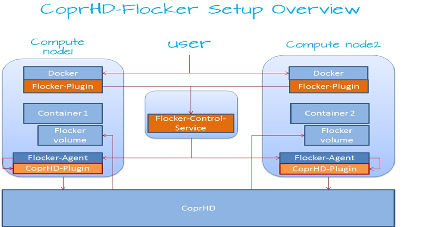
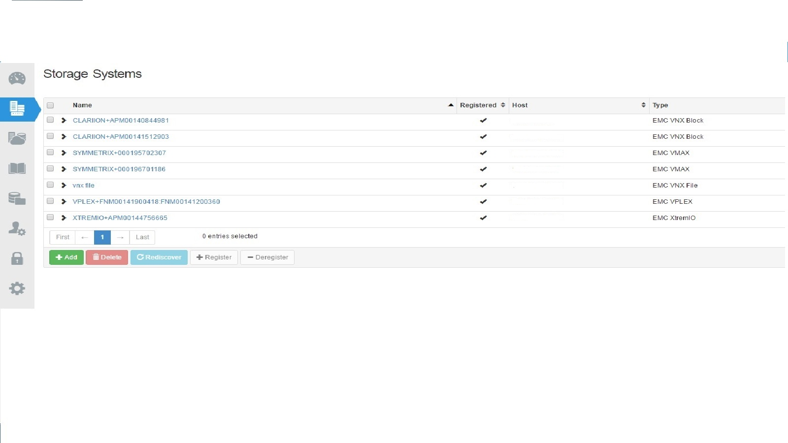
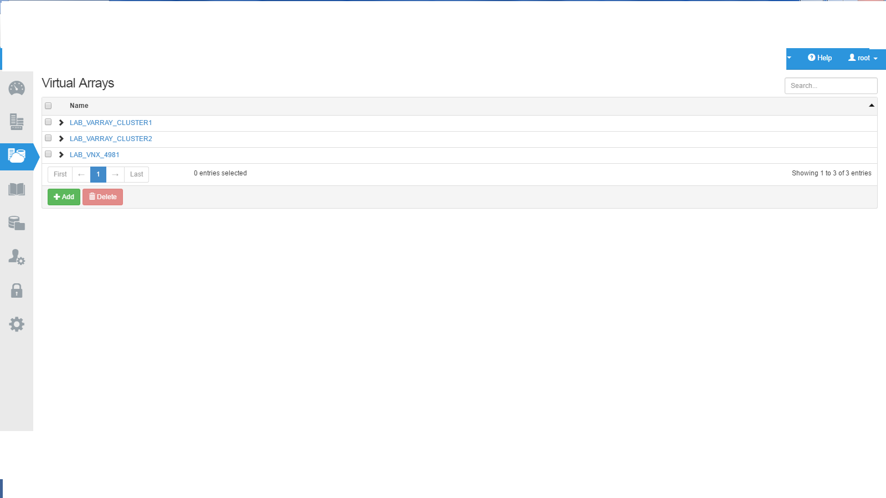
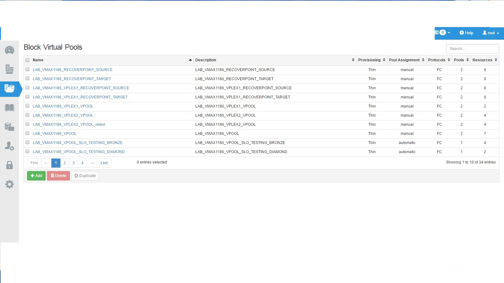

COPRHD Flocker Plugin
======================
The plugin for COPRHD Flocker integration.

## COPRHD Flocker Intergration Block Diagram
 


verfied versions
CoprHD - 2.4.1
Ubuntu – 14.04.03 – LTS 
Flocker – 1.10.2
Docker – 1.10.1 - build 9e83765


## Installation
---------------
- Install CoprHD 2.4.1, please refer below links to download,build and setup CoprHD.
    https://coprhd.atlassian.net/wiki/display/COP/How+to+Build+and+Run+CoprHD 
    https://coprhd.atlassian.net/wiki/display/COP/How+to+download+and+build+CoprHD 

- once you are able to install and login to CoprHD. you should discover storage systems, create virtual arrays and virtual pools. Below you can see screenshots.

	
    
       b. Configure Virtual array 

	

      c. Configure Virtual Pools - In Virtual pools policies are configured 

	


- Install OpeniSCSI 

    * Ubuntu<br>
    ```bash
    sudo apt-get update
    sudo apt-get install -y open-iscsi
    sudo apt-get install -y lsscsi
    sudo apt-get -y install scsitools
    ```
    * Centos<br>
    ```bash
    sudo yum -y install iscsi-initiator-utils
    sudo yum -y install lsscsi
    sudo yum -y install sg3_utils
    ```
	
- Discover iSCSI of storage array<br>
   ```bash
    sudo iscsiadm -m discovery -t st -p {ipaddress of storage array iscsi port}
	```
- Login iSCSI data port<br>
   ```bash
   scsiadm -m node  -p ${ipaddress of storage array iscsi portal} --login
   ```
   
- Install ClusterHQ/Flocker
Refer to ubuntu install notes -> https://docs.clusterhq.com/en/0.4.0/

- Install CoprHD Flocker Plugin 
	```bash
	git clone https://<userid>@review.coprhd.org/scm/ce/flocker-driver.git
	cd copr-hd
	sudo /opt/flocker/bin/python setup.py install
	```

- Install CoprHD-cli 2.3 or above
   ```bash
   Refer the below link for more information
   http://www.emc.com/collateral/TechnicalDocument/docu62079.pdf
   ```
   
## Usage Instructions
To start the plugin on a node, a configuration file must exist on the node at /etc/flocker/agent.yml.
```bash
control-service: {hostname: ${ipaddress}, port: ${port}}
dataset: {backend: coprhd_flocker_plugin}
version: 1
dataset:
    backend: coprhd_flocker_plugin
    coprhdhost: ${coprhd_hostname}
    port: ${coprhd_port}
    tenant: ${coprhd-tenant}
    project: ${coprhd-project}
    varray: ${coprhd-varray}
    cookiedir: ${cookiedir}
    vpool: ${vpool}
    vpool_gold: ${vpool_gold}
    vpool_silver: ${vpool_silver}
    vpool_bronze: ${vpool_bronze}
	vpool_platinum: ${vpool_platinum}
	hostexportgroup: ${ipaddress of flocker agent host}
	coprhdcli_security_file: ${coprhdcli_security_file}
```

The below test case have been tested 

1. Using docker start a application and provision a volume on demand
2. Using docker move a application from one node to another node with persistent storage 

Docker commands are below 

docker run -v <volume-name>:/data --volume-driver=<driver-name> -ti busybox sh

Debug: 

	The log files are /var/log/flocker  

When docker starts host will get created on Vipr 


In Vipr when storage is getting provisioned the same will get refrected in the vipr Dashboard in the task list


10. Generating & using security file
=========================================
pre-requisites easy_install pycrypto

* use the file encrypt_password.py in util folder to generate a
  security file, which has the username and password in an encrypted form.

* Usage of encrypt_password.py:
```
   python encrypt_password.py -user <vipruser> -password <viprpassword>
            -securityfile <complete filepath where encrypted security is stored>
               -flockeruser <User account which runs the root service>
```
* The security file generation can be done in two ways
   1. The admin can login as root user and then run the above command to
      generate a security file at a location, which is accessible to only
      "root" user account.

                        OR

   2. Login as the root user and then open /etc/passwd and then go to the
      entry named root.

      Change the last entry from /sbin/nologin to /bin/bash and you will 
      be able to run commands through the account "root"

      Make sure that the encrypt_password.py is placed in a location, which
      has permission for root user and run the below command and run the
      below command

      ```
       su -l root -c "python <appropriatefolder>/encrypt_password.py 
                              -user <vipruser> -password <viprpassword> 
            -securityfile <filepath_where_encrypted_security_is_stored> 
               -coprhduser <User_account_which_runs_the_coprhd_service>"
      ```
* open /etc/flocker/agent.yml and make following changes
   ```
   coprhd_security_file=<filepath_where_encrypted_security_is_stored>
   ```
   
  If the vipr_security_file entry is not specified or is empty,
  then the regular username and password fields will be used.


